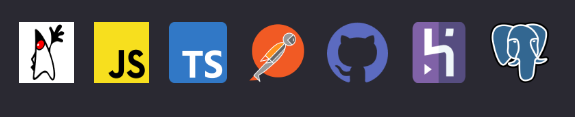

#  Semana Spring React - SDS 4.0

## O projeto envolve programação orientada a objetos, banco de dados relacional, HTML/CSS/JS básico e outros.

Foi desenvolvido um aplicativo web completo, utilizando Spring Boot no back end, e ReactJS no front end.

### Stack utilizada:

